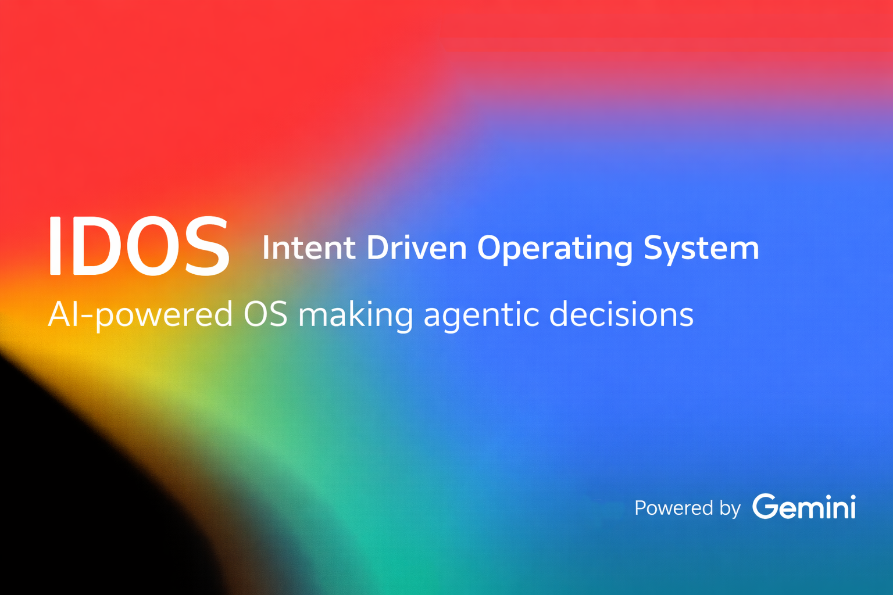

<div align="center">



</div>

<div align="center">

# 🖥️ IDOS — Intent-Driven OS

### *Describe what you want. Get the workspace you need.*

**Natural language → Intelligent workspace → AI-controlled apps**

[](https://nextjs.org/)
[](https://react.dev/)
[](https://www.typescriptlang.org/)
[](https://ai.google.dev/)

</div>

---

## 📌 What is IDOS?

**IDOS** is an **Intent-Driven Operating System** built as a web application. You describe your goal in plain language; IDOS creates a workspace with the right applications, layout, and system modes—and can **control those apps** through an AI agent that discovers and invokes tools on your behalf.

- **Workspace creation** — *"Open notes, timer, and todo"* → instant layout with Notes, Timer, and Todo.
- **AI agent control** — *"Find all meeting notes and create a summary, then add a task due Friday"* → the AI discovers tools, runs them in sequence, and updates the UI in real time.

No menus, no app hunting. **Intent in, workspace out.**

---

## ✨ Key Capabilities

| Area | Capabilities |
|------|--------------|
| **Workspace** | 12 core apps • 3 system modes (Focus, Dark, Do Not Disturb) • 70+ workspace combinations • Multiple layout strategies (floating, grid, split, tiled) |
| **AI agent** | Tool registry • Dynamic tool discovery • Streaming execution with real-time UI feedback • Multi-step task orchestration • Conversation memory |
| **File system** | Virtual Unix-style paths • IndexedDB-backed storage • Read/write/list/delete/move • App-agnostic file API |
| **Interaction** | Drag & drop windows • Resize handles • Snap-to-grid • Magnetic edges • Optimistic updates |

---

## 🏗️ Architecture at a Glance

```
User Intent → AI (Gemini) → Workspace Config / Agent Tools → Layout Engine → App Renderer
                                    ↑
                    Tool results & feedback (streaming)
```

### Three-layer model

1. **Workspace manager** — Current workspace config, modes, history; receives parsed intent and tool results.
2. **Layout engine** — Computes positions from workspace config; supports floating, grid, split, tiled.
3. **App renderer** — Instantiates app components at given coordinates; passes modes and props.

### Core components (agent extension)

| Component | Responsibility |
|-----------|-----------------|
| **Agent controller** | Orchestrates AI tool-execution loop (client React hook) |
| **Tool registry** | Maps app actions to executable tools (Zustand store) |
| **Tool executor** | Invokes tools and streams results (API + client) |
| **Gemini function calling** | Chooses which tools to call and in what order |
| **Feedback stream** | Real-time UI updates during execution (SSE + React state) |

---

## 🛠️ Tech Stack

| Layer | Technology |
|-------|------------|
| Framework | **Next.js 16** (App Router, API routes) |
| UI | **React 19**, **Tailwind CSS 4**, **Framer Motion**, **Radix UI** |
| State | **Zustand** (workspace, agent, tool registry, personalization) |
| Storage | **IndexedDB** (virtual file system) |
| AI | **Google Gemini** (intent parsing, agent function calling) |
| Language | **TypeScript** |

---

## 🚀 Getting Started

### 1. Install dependencies

```bash
npm install
```

### 2. Environment

Create `.env.local` in the project root:

```env
GEMINI_API_KEY=your_gemini_api_key_here
```

Get a key from [Google AI Studio](https://aistudio.google.com/app/apikey). `GOOGLE_GENERATIVE_AI_API_KEY` is also supported.

### 3. Run

```bash
npm run dev
```

Open [http://localhost:3000](http://localhost:3000).

### 4. Try it

**Workspace creation**

- *"Take notes and set a 25 min timer"*
- *"I need a todo list and dark mode"*
- *"Write an email draft"*

**Agent control** (when supported)

- *"Find all notes about meetings and create a summary"*
- *"Add a high-priority task: Review project summary, due Friday"*

---

## 📦 Applications (12)

| App | Purpose |
|-----|---------|
| **Notes** | Writing, documentation; reads/writes text files |
| **Timer** | Pomodoro / time management |
| **Todo** | Task lists; stored in file system |
| **Code Editor** | Code files with syntax highlighting |
| **Quiz** | Flashcards / study |
| **Email** | Composer, drafts |
| **Calendar** | Scheduling, events |
| **File Browser** | Navigate virtual file system |
| **Whiteboard** | Excalidraw-based diagrams |
| **AI Chat** | Conversational assistant |
| **Explanation Panel** | Contextual help |
| **Terminal** | Command interface |

Apps self-register **tools** (e.g. `notes_create_note`, `todo_add_task`) with the Tool Registry so the AI agent can control them via Gemini function calling.

---

## 🤖 AI Agent Control Flow

1. **User input** — e.g. *"Find all meeting notes and add a summary task."*
2. **Intent routing** — Classify: workspace-only vs. agent control.
3. **Agent init** — Load tools from registry → send to Gemini as function declarations.
4. **Tool selection** — Gemini returns `functionCall(name, args)`.
5. **Tool execution** — Validate → run `tool.execute(params)` → stream result.
6. **Result integration** — Update UI (highlight, scroll, flash); send result back to Gemini.
7. **Iteration** — Repeat until task complete or max iterations.

Streaming is over **Server-Sent Events** (`/api/agent-execute`); the client shows tool calls, results, and thinking in the **Agent Panel**.

---

## 📁 Project Structure

```
src/
├── app/
│   ├── api/                    # API routes
│   │   ├── agent-execute/     # Streaming agent execution
│   │   ├── parse-intent/      # Intent → workspace config
│   │   ├── chat/              # Chat completions
│   │   └── send-email/
│   ├── layout.tsx
│   ├── page.tsx
│   └── globals.css
├── apps/                       # App registry + 12 apps
│   ├── registry.tsx           # App ID → component map
│   ├── notes/, todo/, timer/, calendar/, code-editor/, …
│   └── **/tools.ts            # App-specific agent tools
├── components/
│   ├── agent-panel/           # Agent execution UI
│   ├── app-window/            # Draggable/resizable window
│   ├── intent-blob/           # Intent input
│   ├── idos-shell/, taskbar/, boot-screen/, …
│   └── ui/                    # Shared UI (buttons, dialogs, …)
├── features/
│   ├── intent/                # Intent input
│   └── workspace/             # Workspace view, layout engine, app renderer
├── hooks/
│   └── use-agent-execution.ts # Agent SSE + events
├── lib/
│   ├── gemini/                # Gemini agent client
│   ├── file-system/           # File system API + IndexedDB adapter
│   ├── types/                 # App, workspace, agent, tools, …
│   └── constants/             # App catalog, defaults, themes
└── store/
    ├── use-workspace-store.ts
    ├── use-agent-store.ts
    ├── use-tool-registry.ts
    └── use-agent-sessions-store.ts
```

---

## 📚 Documentation

| Document | Description |
|----------|-------------|
| [Intent-Driven OS: Frontend Architecture](Documentation/Intent_Driven_OS_Frontend_Architecture.pdf) | Workspace model, app registry, state, file system, drag/drop, modes, layout, data flow |
| [Intent-Driven OS: AI Agent Control](Documentation/Intent_Driven_OS_AI_Agent_Control.pdf) | Tool registry, agent flow, Gemini integration, real-time feedback, implementation phases |
| [Developer Guide](Documentation/DEVELOPER_GUIDE.md) | Development setup and conventions |
| [User Manual](Documentation/USER_MANUAL.md) | End-user usage |

---

## 📄 Scripts

| Command | Description |
|---------|-------------|
| `npm run dev` | Start development server |
| `npm run build` | Production build |
| `npm run start` | Start production server |
| `npm run lint` | Run ESLint |

---

<div align="center">

**IDOS** — *Organize around intent, not apps.*

</div>
